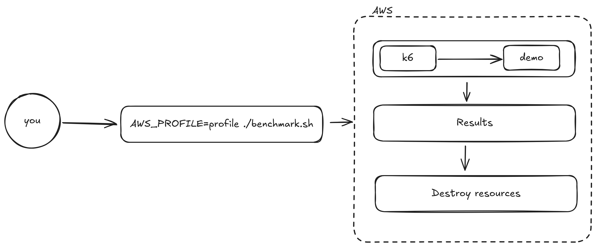

# Kubernetes Watt Benchmarking

Run Platformatic Watt performance benchmarks in Amazon EKS (Elastic Kubernetes Service).

## Overview

The `benchmark.sh` script automates the creation of an EKS benchmarking workflow:
1. Builds the Docker image locally and pushes to an ephemeral ECR repository
2. Creates an EKS cluster and EC2 load testing instance
3. Runs k6 load tests against the cluster
4. Cleans up all resources automatically

```
┌─────────────────────────────────────────────────────────────────────────────┐
│                              LOCAL MACHINE                                  │
│  ┌─────────────┐     ┌─────────────┐                                        │
│  │   demo/     │────▶│   Docker    │                                        │
│  │  Dockerfile │     │   Build     │                                        │
│  └─────────────┘     └──────┬──────┘                                        │
└─────────────────────────────┼───────────────────────────────────────────────┘
                              │
                              ▼
┌─────────────────────────────────────────────────────────────────────────────┐
│                              AWS ACCOUNT                                    │
│                                                                             │
│  ┌─────────────┐         ┌──────────────────────────────────────────────┐   │
│  │     ECR     │◀────────│              Docker Image                    │   │
│  │  Repository │         └──────────────────────────────────────────────┘   │
│  └──────┬──────┘                                                            │
│         │                                                                   │
│         │ pull                                                              │
│         ▼                                                                   │
│  ┌──────────────────────────────────────────┐      ┌───────────────────┐    │
│  │              EKS Cluster                 │      │   EC2 Instance    │    │
│  │  ┌────────┐  ┌────────┐  ┌────────┐      │      │                   │    │
│  │  │  Node  │  │  PM2   │  │  Watt  │      │      │       k6          │    │
│  │  │  NLB   │  │  NLB   │  │  NLB   │◀─────┼──────│   Load Testing    │    │
│  │  └────────┘  └────────┘  └────────┘      │      │                   │    │
│  └──────────────────────────────────────────┘      └───────────────────┘    │
│                                                                             │
└─────────────────────────────────────────────────────────────────────────────┘
                              │
                              ▼
                       ┌─────────────┐
                       │   Cleanup   │
                       │  All AWS    │
                       │  Resources  │
                       └─────────────┘
```

## Prerequisites

> [!Note]
> The default maximum number of vCPU that AWS supports is 32. The default settings here
> use 26 vCPU.

- **Docker** - installed and running ([installation guide](https://docs.docker.com/get-docker/))
- **Docker Buildx** - available through Docker Desktop or the Docker CLI
- **AWS CLI v2** - installed and configured
    - We use your profile's region so make sure that a default is set:
        ```sh
        aws configure
        ```
    - Permissions for AWS profile are set. See [minimum-policy.json](./lib/minimum-policy.json). To apply
      these policies:
      ```sh
      AWS_PROFILE=<your-profile-name> ./setup-policy.sh
      ```
- **kubectl** - Kubernetes CLI tool ([installation guide](https://kubernetes.io/docs/tasks/tools/))
- **jq** - JSON processor for parsing kube context

Before provisioning anything, run the read-only preflight:

```sh
AWS_PROFILE=<your-profile-name> ./preflight.sh
```

The preflight checks local tools, AWS identity and region, selected quotas, and
the required IAM actions through policy simulation. It does not create or modify
AWS resources.

How it works:



## Usage

Run these commands from the repository root. Set `AWS_PROFILE` to an AWS CLI
profile with a configured default region. The benchmark runs the Docker build
itself, so manually building an image is optional.

The Next image installs private npm packages using a BuildKit secret. By default
the secret is read from `$HOME/.npmrc`; set `NPMRC_PATH` when using another npm
credentials file. The npm configuration must authenticate the registry serving
the `@platformatic` packages, for example:

```ini
@platformatic:registry=https://registry.npmjs.org/
//registry.npmjs.org/:_authToken=<npm-token>
```

Do not commit this file or pass the token through Docker `ARG` or `ENV`.

### Build Images Manually

```sh
docker buildx build --load \
  --secret id=npmrc,src="$HOME/.npmrc" \
  --platform linux/amd64 \
  --build-arg SSRT_ENABLED=0 \
  -t next-control:test \
  ./next

docker buildx build --load \
  --secret id=npmrc,src="$HOME/.npmrc" \
  --platform linux/amd64 \
  --build-arg SSRT_ENABLED=1 \
  -t next-ssrt:test \
  ./next
```

### SSRT Comparison

Each invocation benchmarks the existing Node, PM2, and Watt runners. Run it once
with SSRT disabled and once with SSRT enabled. Keep all other environment
variables identical between runs.
Use distinct cluster names and image tags so the results cannot overwrite one
another:

```sh
AWS_PROFILE=<your-profile-name> \
CLUSTER_NAME=next-control-<run-id> \
IMAGE_TAG=next-control-<run-id> \
SSRT_ENABLED=0 \
RUN_ORDER=pm2,watt,node \
./benchmark.sh

AWS_PROFILE=<your-profile-name> \
CLUSTER_NAME=next-ssrt-<run-id> \
IMAGE_TAG=next-ssrt-<run-id> \
SSRT_ENABLED=1 \
RUN_ORDER=pm2,watt,node \
./benchmark.sh
```

The control and SSRT images both use `@platformatic/ssrt-next`; the only build
difference is `experimental.ssrTemplates`.

### Detached runs

Run the orchestrator detached from the terminal with `--detach`:

```sh
AWS_PROFILE=<your-profile-name> \
CLUSTER_NAME=next-control-<run-id> \
IMAGE_TAG=next-control-<run-id> \
SSRT_ENABLED=0 \
./benchmark.sh --detach
```

The command prints the background PID and writes output to
`benchmark-detached-<timestamp>.log`. The load-test EC2 instance continues
independently after the terminal is closed. If the laptop goes to sleep, the
local orchestrator pauses and resumes when it wakes; AWS resources remain
tracked in `.benchmark-state/`, and `cleanup.sh` can remove them if needed.

### Full Runner Matrix

The two invocations above form the full six-result matrix: control and SSRT for
each of Node, PM2, and Watt. The harness deploys all three runners for every
invocation, so do not set a runner-specific variable.

Run once with `RUN_ORDER=pm2,watt,node` and once with `RUN_ORDER=node,watt,pm2`.
This provides the planned A/B and B/A ordering. Do not change node
type, node count, pod resources, replica count, database delay, workload, or
warm-up settings between corresponding runs.

### Single-arm benchmark

For a single arm, run:

```sh
AWS_PROFILE=<your-profile-name> SSRT_ENABLED=0 ./benchmark.sh
# or
AWS_PROFILE=<your-profile-name> SSRT_ENABLED=1 ./benchmark.sh
```

## Configuration

Required environment variables:
| Variable | Description |
|---|---|
| `AWS_PROFILE` | The AWS profile to use when making requests to AWS via the CLI |

Optional environment variables:

| Variable | Default | Description |
|----------|---------|-------------|
| `CLUSTER_NAME` | `watt-benchmark-<timestamp>` | EKS cluster name |
| `NODE_TYPE` | `m5.2xlarge` | Instance type for EKS worker nodes |
| `NODE_COUNT` | `4` | Number of worker nodes |
| `AMI_ID` | `ami-07b2b18045edffe90` | Amazon Linux 2023 AMI for k6 instance |
| `LOADTESTING_INSTANCE_TYPE` | `c7gn.2xlarge` | EC2 instance type for k6 (16GB RAM for 10k VUs) |
| `ECR_REPO_NAME` | `watt-benchmark` | ECR repository name |
| `IMAGE_TAG` | `next-ssrt-<SSRT_ENABLED>` | Docker image tag |
| `SSRT_ENABLED` | `0` | Set to `1` to build the SSRT templates arm; `0` builds the control arm |
| `RUN_ORDER` | `pm2,watt,node` | Comma-separated runner order for the load test |
| `NPMRC_PATH` | `$HOME/.npmrc` | npm credentials file mounted during the Docker build |
